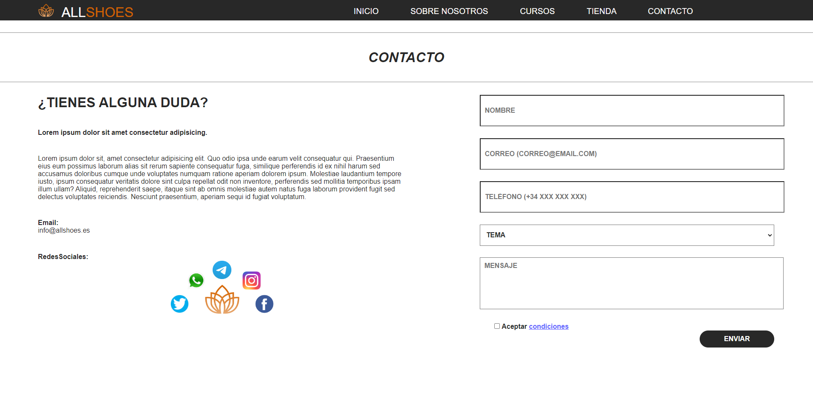

# Menu superior

Esta situado en la parte superior de la página, muestra el logo de la marca a la izquierda, seguido de las opciones principales de navegación: Inicio, Sobre Nosotros, Cursos, Tienda y Contacto. Este menu será siempre visible. Utilizando este menu navegaremos entre las diferentes paginas.

# Inicio

La pagina de inicio tiene una imagen grande en el centro con un texto. Abajo a la izquierda hay una descripcion junto a un boton de comprar que nos redirige a la tienda. A la derecha tenemos 3 imagenes mas de otras 3 zapatillas.

# Sobre Nosotros

Esta pagina muestra a la izquierda una imagen de la tienda. En la parte derecha hay un texto con el nombre de la empresa, el logo de la marca, un texto en negrita, un texto normal y finalmente las redes.

# Cursos

En esta pagina tenemos dos cursos, cada uno contiene una imagen, un titulo, el numero de horas, una descripcion y un boton de "Leer mas".

# Tienda

En esta pagina se mostraran 4 articulos, su precio y un boton de "Agregar al carrito", en la parte inferior hay 3 botones para cambiar de pagina en el caso de que queramos añadir mas articulos.

# Contacto

En esta pagina tenemos un texto a la izquierda junto a las redes sociales, y a la derecha tenemos un formulario que nos pedira el nombre, correo electronico, telefono, tema y mensaje, ademas de una casilla de aceptar condiciones y el boton de enviar.

# Añadidos

Todos los botones reaccionan al pasar el cursor por encima y el menu de navegacion estara siempre en la parte superior aun que bajemos.

